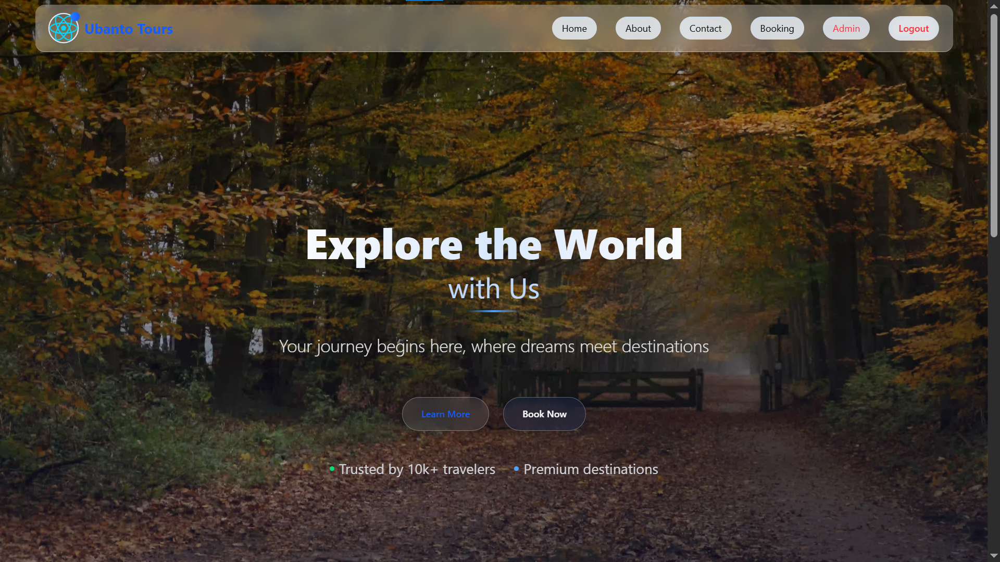

# 🌍 Ubanto Tours - Travel Booking Website

A travel booking web application built using **React**, **React Router**, **Context API**, and **Redux Toolkit**.
This project is part of my learning journey as a **Computer Science student**, where I explored core concepts of frontend development and state management.

---

## Live Demo

**Vercel Deployment:** [Ubanto Tours](https://ubantotours.vercel.app/)

---

## Features

- **User Authentication** (Login/Logout) using Context API
- **Trip Booking Flow** with form validation
- **Recent Trips** listing with Redux Toolkit state management
- **Popular Destinations** showcase
- **Admin Panel** for trip management (frontend-only)
- **Image Handling** – Learned how to convert uploaded images into strings (Base64) for frontend use
- **Dynamic Routing** with React Router DOM
- **Persistent Data** using localStorage

---

## Tech Stack

- **Frontend**: React 19.1.0
- **State Management**: Redux Toolkit 2.8.2 + Context API
- **Routing**: React Router DOM 7.7.1
- **Build Tool**: Vite 7.0.4
- **Styling**: Tailwind CSS 4.1.11

---

## What I Learned

- Setting up and using **React Router** for navigation
- Implementing **Context API** for authentication
- Using **Redux Toolkit** for global state management
- Handling **image-to-string (Base64)** conversion in React
- Managing **localStorage** for data persistence
- Organizing a scalable **React project structure**
- Combining multiple state management approaches in one app

---

## Project Structure

```
src/
├── components/        # Reusable UI components
├── Pages/             # Main pages (Home, Booking, Admin)
├── context/           # Context API setup
├── redux/             # Redux store and slices
├── assets/            # Images and static files
└── routes/            # Routing configuration
```

---

## Getting Started

### Prerequisites

- Node.js (v16 or higher)
- npm or yarn

### Installation

```bash
# Clone repository
git clone https://github.com/yourusername/ubanto-tours.git
cd ubanto-tours

# Install dependencies
npm install

# Start development server
npm run dev
```

Open your browser at: `http://localhost:5173`

---

## 📌 Important Note (Updated: 9/8/2025)

Currently, **no backend is attached** to this project.
You can log in by simply entering your **name** and **email** to see how the booking process works.

**Admin Access for Testing:**

- **Username:** `hamza`
- **Password:** `hamza`

When the admin changes data, it is stored **locally in your browser storage** (localStorage), since there is no server connected.

---

## Contact

- **LinkedIn**: [Hamza Nazir](https://linkedin.com/in/hamzanair1)

---

⭐ _If you find this project interesting, consider starring the repository!_

---


